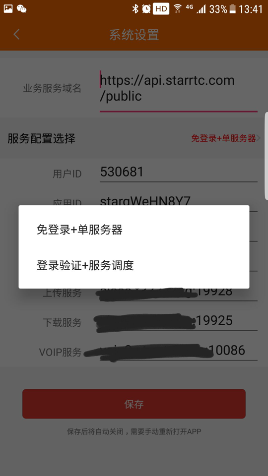
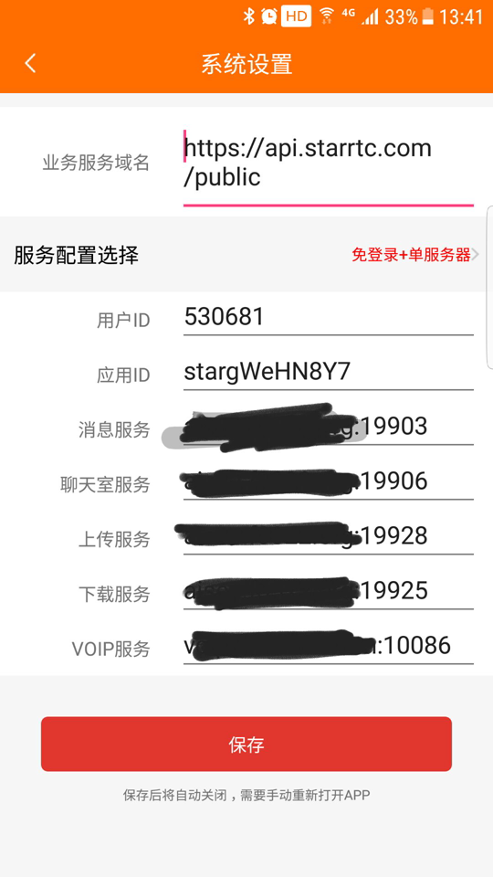
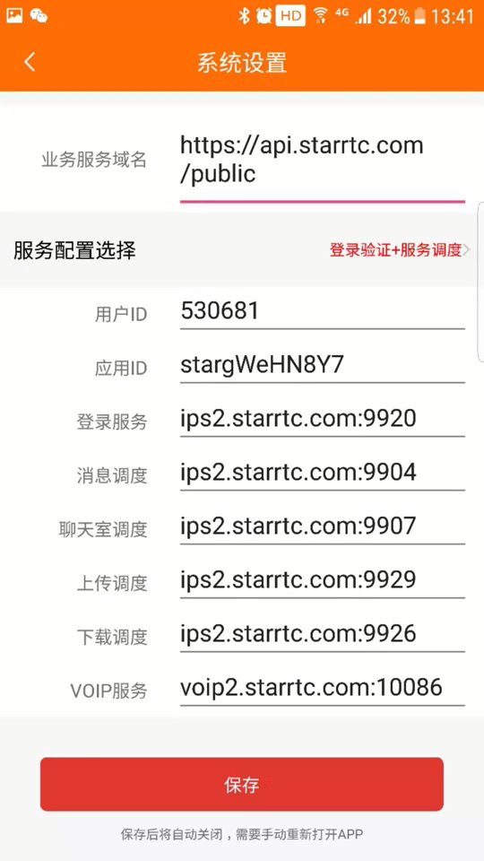

# 服务端程序

现已开放:

1，voip服务端：可用于一对一视频的私有部署；

2，IM消息系统服务端：可用于单聊（如文字聊天），私信，群聊，信令；

其它服务端(聊天室服务，直播连麦，多人会议)正在一个一个开放中，敬请期待...

支持CentOS 64bit，Ubuntu 64bit。

使用SDK部署私有服务来实现一对一音视频功能，详见[开发文档](https://docs.starrtc.com/zh-cn/docs/android-1.html)


客户端示例程序
==
Android: https://github.com/starrtc/starrtc-android-demo

iOS    : https://github.com/starrtc/starrtc-ios-demo

更多   : https://docs.starrtc.com/en/download/


voip服务器部署
==
可用于一对一视频的私有部署

需要开放端口：10086 udp

```java
chmod +x voipServer
./voipServer -appid your_appid
或者后台启动：nohup ./voipServer -appid your_appid > voipServer.log 2>&1 &
查看日志：tail -f voipServer.log
```

测试方法：下载客户端示例程序，修改“服务器配置”里面的应用ID和VOIP服务地址即可。

appid请访问[starRTC后台](https://www.starrtc.com/login.html)获取。


IM服务器部署
==

需要开放端口：

msgServer 		19903(对外) 19902(本地)

chatDBServer 	19908(本地)

groupServer 	19923(本地)

以上均为tcp端口

IM全套服务，分为3个服务端程序，msgServer、chatDBServer、groupServer，分别是

消息服务器、离线消息数据服务器，群管理服务器，分别启动即可。

如果只启动msgServer，就可以当做信令服务器使用；只需要单聊服务的，不需要启动groupServer。

3个服务器会互相有连接，目前端口都是写死的，不存在端口占用的情况下，会自动连接，

等稳定后修改为配置文件模式，这样可以修改端口。


测试方法：

从这一版SDK开始，分为私有部署模式和公有云模式。

走自己服务端的，请使用私有模式来init SDK，详见[文档](https://docs.starrtc.com/zh-cn/docs/android-single-server-init.html) 。

要验证自己服务是否正常，可以下载demo，并在设置里，确认是私有模式，然后填写你自己的服务ip。


模式选择界面：



私有部署设置界面：



公有云设置界面：


Contact
=====
QQ ： 2162498688

邮箱：<a href="mailto:support@starRTC.com">support@starRTC.com</a>

手机: 186-1294-6552

微信：starRTC

QQ群：807242783

参考
==
[阿里云修改安全组规则](https://help.aliyun.com/document_detail/101471.html)

[腾讯云安全组操作指南](https://cloud.tencent.com/document/product/213/18197)

