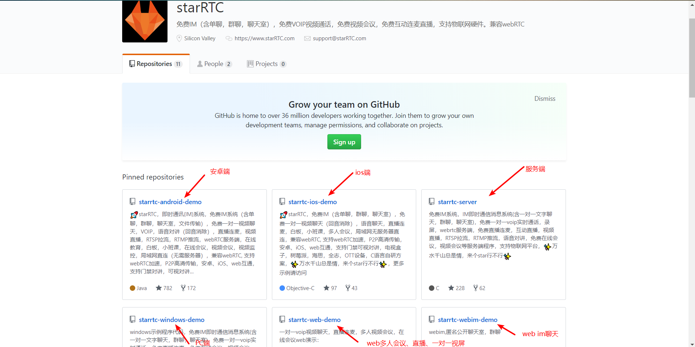
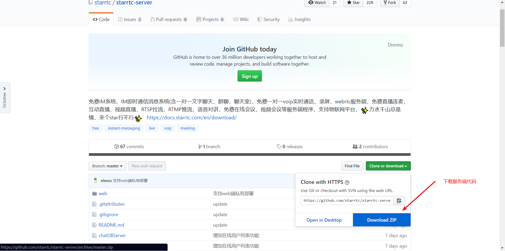
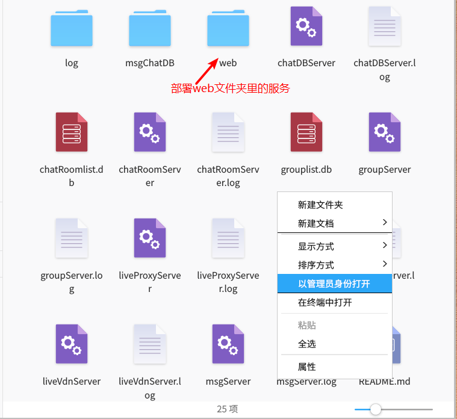
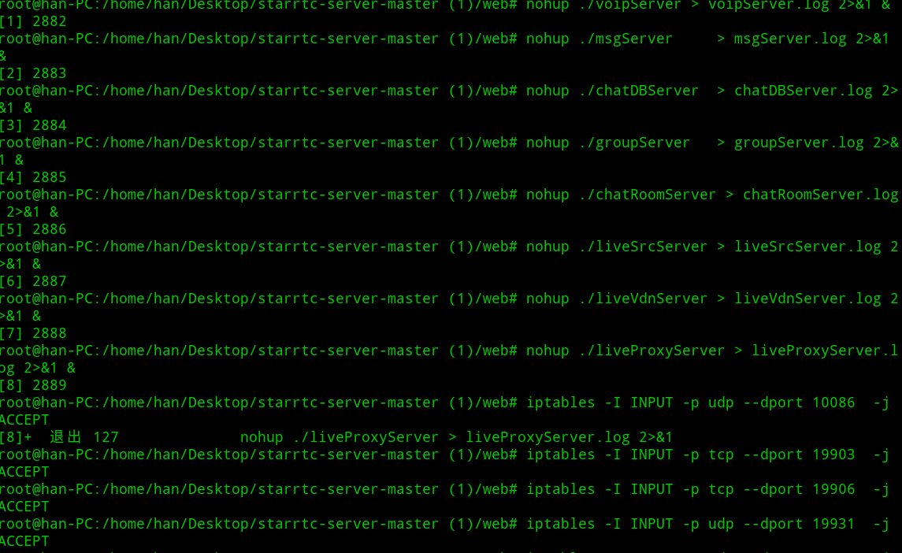
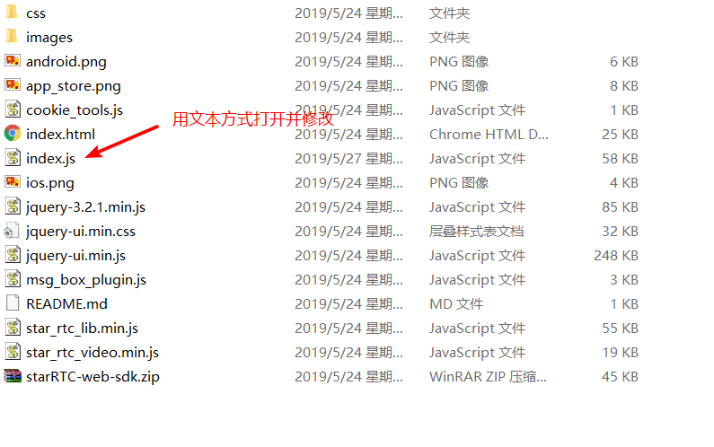
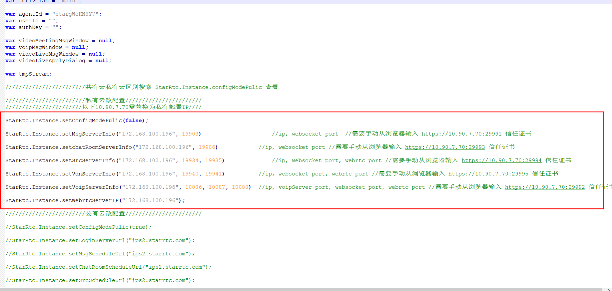

# starRTC-web私有部署步骤

注意事项：
==
1.	下载chrome最新版！,web端私有部署目前只支持chrome 浏览器72版本及以上。

2.	服务端部署 web文件夹里边的服务，只有web文件夹里边的服务支持web私有部署。

一、部署服务端
==
进入starRtc github 开源仓库，地址：[starRTC • GitHub](https://github.com/starrtc/starrtc-server)
 


进入服务端界面
 

 
Linux系统下 进入web文件夹



在终端打开 执行 下面命令 进行部署并开启端口
```java
nohup ./voipServer > voipServer.log 2>&1 &
nohup ./msgServer     > msgServer.log 2>&1 &
nohup ./chatDBServer  > chatDBServer.log 2>&1 &
nohup ./groupServer   > groupServer.log 2>&1 &
nohup ./chatRoomServer > chatRoomServer.log 2>&1 &
nohup ./liveSrcServer > liveSrcServer.log 2>&1 &
nohup ./liveVdnServer > liveVdnServer.log 2>&1 &
nohup ./liveProxyServer > liveProxyServer.log 2>&1 &

iptables -I INPUT -p udp --dport 10086  -j ACCEPT
iptables -I INPUT -p tcp --dport 19903  -j ACCEPT
iptables -I INPUT -p tcp --dport 19906  -j ACCEPT
iptables -I INPUT -p udp --dport 19931  -j ACCEPT
iptables -I INPUT -p udp --dport 19928  -j ACCEPT
iptables -I INPUT -p tcp --dport 19932  -j ACCEPT
iptables -I INPUT -p tcp --dport 29991  -j ACCEPT
iptables -I INPUT -p tcp --dport 29992  -j ACCEPT
iptables -I INPUT -p tcp --dport 29993  -j ACCEPT
iptables -I INPUT -p tcp --dport 29994  -j ACCEPT
iptables -I INPUT -p tcp --dport 29995  -j ACCEPT
iptables -I INPUT -p udp --dport 19906  -j ACCEPT
```


没有报错，部署成功！

二、修改并启动web端
==


进入web多人会议、直播、一对一视屏

下载demo源码

修改index.js 服务端地址

 
 
 

修改为刚才部署服务端的linux的IP地址后，启用代码。保存

三、配置安卓端
==
下载最新版安卓客户端，安装后进入设置，服务器配置，在配置切换

里切换到私有部署，将ip改为刚才部署服务端的linux的IP地址 保存重新启动，查看配置是否生效。生效后，即可与web进行通讯。

感谢群友3509673316贡献此文档


